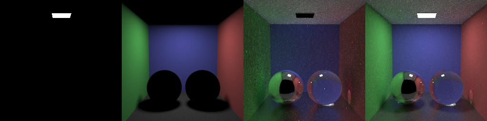
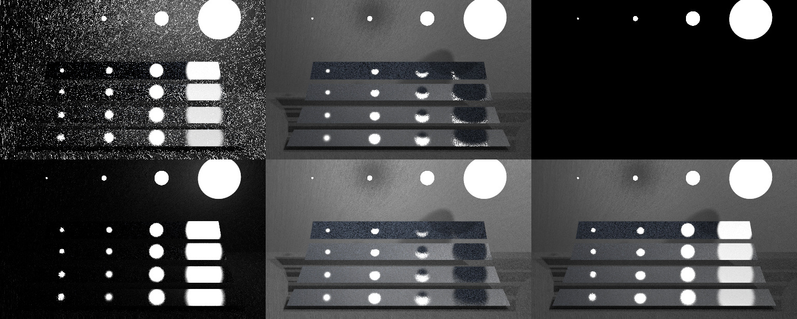
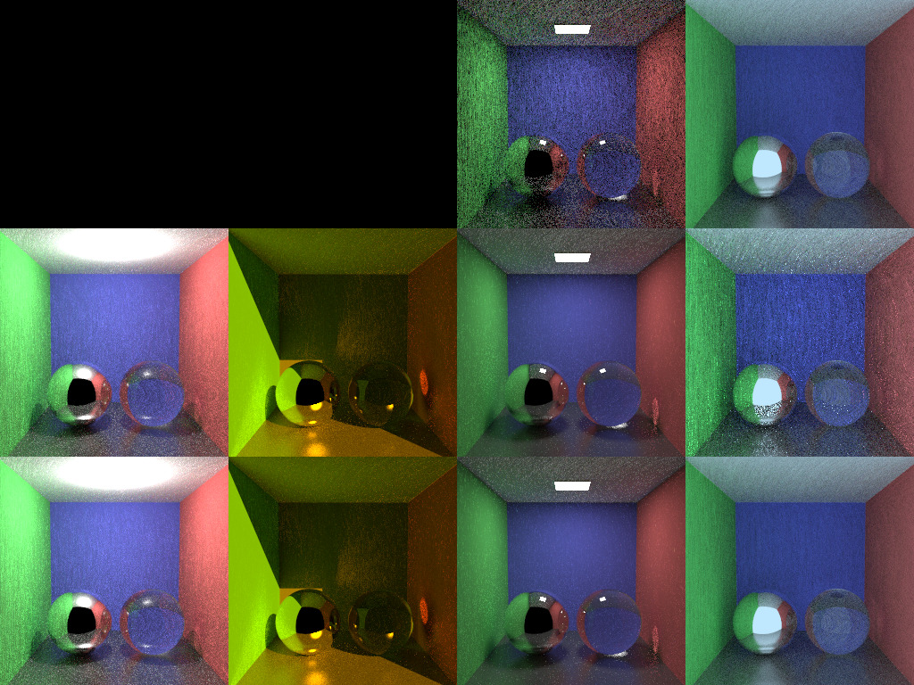

# ky

[中文讲解](https://infancy.github.io/smallpt2pbrt.html)

single file ray tracing renderer, [100](./smallpt/nanopt.cpp)/[300](./smallpt/smallpt_comment.cpp)/[1000](./smallpt/smallpt_rewrite.cpp)/[4000](./ky.cpp) lines of C++20, PBRT-like architecture, step-by-step integrator.

the name `ky` is meaningless, you can call this project `structured smallpt`, `smallpbrt` etc.

# feature

<!--
ky is based on smallpt at first, gradually rewritten into PBRT style...
-->

`render_lighting_enum()`:

`render_mis_scene()`:

`render_multi_sceen()`:

# milestone

- [x] run smallpt
- [x] rewrite smallpt
  - [x] geometry
  - [x] shape
    - [x] disk
    - [x] triangle
    - [x] rectangle
    - [x] sphere
  - [x] scene
  - [x] camera
  - [x] material
  - [x] light
  - [x] integrator
  - [ ] cmd
- [ ] step-by-step integrator 
  - [ ] render depth, normal
  - [ ] render point light
  - [ ] render spuclar material
  - [ ] render direct lighting(sampling brdf, sampling lighting)
  - [x] MIS
  - [x] recursion style pathtracing
  - [x] iterative style pathtracing
 
- [x] bsdf/material
  - [x] Phong
- [x] scene
  - [x] mis scene

<!--
 
- [ ] unity support
- [ ] web support

## kys

- [ ] direct lighting
- [ ] lambert/specular BRDF
- [ ] .ppm

## kye

- [ ] color_t -> spectrum_t
- [ ] matrix_t
- [ ] CUDA support

-->

# credits

- smallpt: Global Illumination in 99 lines of C++ http://www.kevinbeason.com/smallpt/

  - C# vs C++ 全局照明渲染性能比试 https://www.cnblogs.com/miloyip/archive/2010/06/23/cpp_vs_cs_GI.html   

- Scratchapixel https://www.scratchapixel.com/index.php?redirect   

- https://github.com/SmallVCM/SmallVCM

- ouj/safegi: implementation of safegi: an rendering system with dimensional analysis. https://github.com/ouj/safegi

- hi2p-perim/minpt: A path tracer in 300 lines of C++ https://github.com/hi2p-perim/minpt   

- mmp/pbrt-v3: Source code for pbrt, the renderer described in the third edition of "Physically Based Rendering: From Theory To Implementation", by Matt Pharr, Wenzel Jakob, and Greg Humphreys. https://github.com/mmp/pbrt-v3

- https://github.com/mmp/pbrt-v4

- https://github.com/mitsuba-renderer/mitsuba2

- xelatihy/yocto-gl: Yocto/GL: Tiny C++ Libraries for Data-Driven Physically-based Graphics https://github.com/xelatihy/yocto-gl

